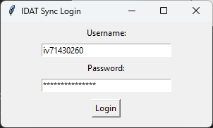
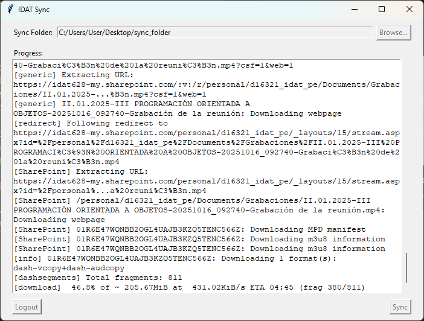
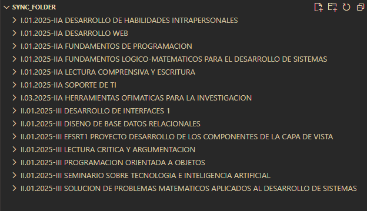
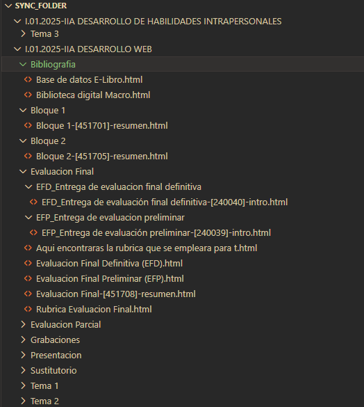
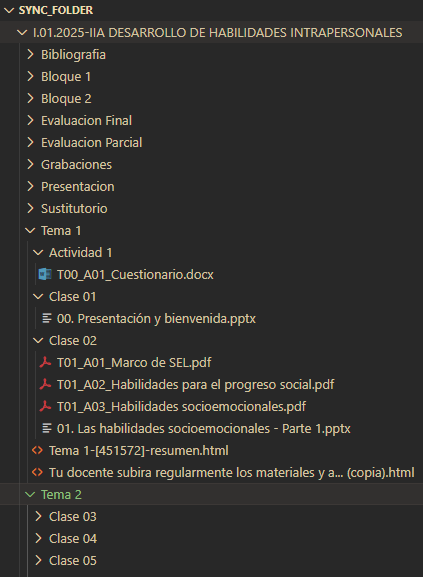

# idat-sync

[](https://github.com/tony-97/idat-sync/actions/workflows/build_and_deploy.yml)
[](https://github.com/tony-97/idat-sync/actions/workflows/build_and_deploy.yml)
[](https://github.com/tony-97/idat-sync/actions/workflows/build_and_deploy.yml)

[](https://github.com/tony-97/idat-sync/releases/latest)
[](https://github.com/tony-97/idat-sync/releases)
[](LICENSE)
[](https://www.python.org/)

idat-sync automatiza la descarga y organización del material de tus cursos (Moodle, SharePoint/OneDrive) y las grabaciones de clase. Está pensado para evitar la tarea tediosa de abrir muchos enlaces, crear carpetas manualmente y perder tiempo buscando archivos dispersos.

## ¿Qué hace?

- Descarga y organiza automáticamente los archivos por curso y módulos.
- Descarga grabaciones de video (cuando aun están accesibles) y las guarda en la estructura del curso.
- Interfaz gráfica simple para seleccionar carpeta de sincronización y ver el progreso.

## Descargar

Descarga la última versión desde [GitHub Releases](https://github.com/tony-97/idat-sync/releases/latest):

| Sistema Operativo | Archivo                                                                                                        | Notas                                          |
| ----------------- | -------------------------------------------------------------------------------------------------------------- | ---------------------------------------------- |
| **Windows**       | [`idat_sync-Windows.exe`](https://github.com/tony-97/idat-sync/releases/latest/download/idat_sync-Windows.exe) | Ejecutable portable, no requiere instalación   |
| **Linux**         | [`idat_sync-Linux`](https://github.com/tony-97/idat-sync/releases/latest/download/idat_sync-Linux)             | Dar permisos de ejecución antes de usar        |
| **macOS**         | [`idat_sync-macOS.dmg`](https://github.com/tony-97/idat-sync/releases/latest/download/idat_sync-macOS.dmg)     | Aplicación sin firmar, ver instrucciones abajo |

### macOS (aplicación sin firmar)

Al ser una aplicación sin firmar, macOS bloqueará su ejecución por defecto. Sigue estos pasos:

1. **Monta el DMG** haciendo doble clic en `idat_sync-macOS.dmg` y arrastra la app a la carpeta **Aplicaciones**.

2. **Elimina el atributo de cuarentena** abriendo la Terminal y ejecutando:

   ```shell
   xattr -cr /Applications/idat_sync.app
   ```

3. **Abre la aplicación** normalmente desde Aplicaciones.

## Instalación (desde código fuente)

1. **Requisitos**

   > - Python 3.10+
   > - [ffmpeg](https://www.ffmpeg.org/)

2. **Instalar el paquete:**
   ```shell
   pip install git+https://github.com/tony-97/idat-sync
   ```
3. **Instalar el navegador para Playwright (solo en Linux / macOS):**
   - Para Linux:
     ```shell
     playwright install chromium
     ```
   - Para macOS:
     ```shell
     playwright install webkit
     ```

## Cómo usar

1. Una vez instalado, simplemente ejecuta el siguiente comando en tu terminal para abrir la aplicación:
   ```shell
   idat_sync
   ```
2. En la ventana:
   - Ingresa tu codigo de alumno y contraseña.

     

   - Completa la autenticación de dos factores (2FA) con el código recibido en tu dispositivo móvil.
   - Una vez que cargue la ventana principal, selecciona la carpeta de destino para tus archivos.
   - Haz clic en el botón **"Sync"** para iniciar el proceso. Podrás ver el progreso en la misma ventana.
     

3. Los archivos se descargarán y organizarán en la carpeta que seleccionaste.

## Capturas de pantalla

### Estructura del material sincronizado



 

## TODO

- [ ] Archivo de configuración usando la libreria platformdirs.
- [ ] Versión mobil.
- [ ] Opción para seleccionar cursos específicos para sincronizar.
- [ ] Descargar los contenidos html en pdf.
